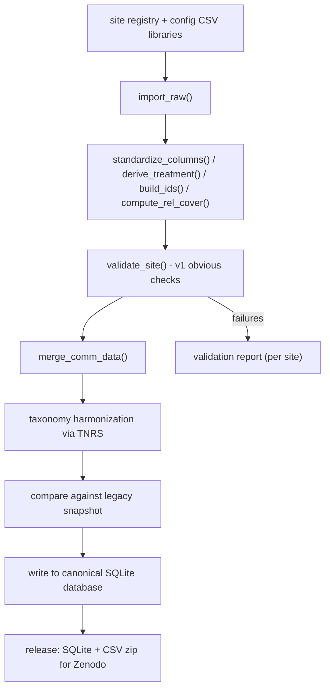

# TransPlant Network Data Cleaning

This repository cleans, merges, and validates plant community data from the
TransPlant Network - a network of elevational gradients across which whole
plant communities are transplanted to lower elevations to simulate climate
warming - and writes the result to a single canonical database.

- TransPlant Network website: TBA

If you have data from a transplant experiment or additional data from existing sites in the database, you can submit your data here: TBA

## Cleaning and checking workflow

Each site's raw data (whatever format it arrives in) goes through the same
sequence of steps to reach the canonical, validated dataset:



- **Site registry** (`R/functions/site_registry.R`): one row per site for
  structural differences (raw format, cover unit, treatment rule, ID
  components), plus pointers into shared cleaning code.
- **Config libraries** (`config/*.csv`): editable lookup tables
  (metadata, treatments, cover scales, species renames, taxonomy overrides,
  merge filters). See "Config libraries vs cleaning code" below.
- **Import & clean** (`R/functions/pipeline/`): `import_raw()` reads the raw
  file (excel/csv/sqlite/...), then `standardize_columns()`,
  `derive_treatment()`, `build_ids()`, and `compute_rel_cover()` turn it into
  the canonical column set. One site (`US_Arizona`) still uses its original
  cleaning script instead - see "Adding or updating a site" below.
- **Validation** (`R/functions/pipeline/validate_site.R`): a small, growable
  set of schema/value/referential checks (see "Validation, taxonomy,
  regression and the output database" below).
- **Merge**: all sites' cleaned community tables are combined into one
  dataset (`merge_comm_data()`).
- **Taxonomy**: species names are resolved/harmonized once, after merging
  (with optional overrides from `config/taxonomy_overrides.csv`).
- **Regression check**: the merged output is compared against a saved
  snapshot of the previous (Drake) pipeline's output, so refactoring
  sites can't silently lose or change data unnoticed.
- **Database & release**: the validated, taxonomy-harmonized dataset is
  written to SQLite; the release step also exports the same tables as CSV
  for Zenodo (see "Releasing a new data version").

## Config libraries vs cleaning code

Site differences are split on purpose:

| Kind | Where it lives | Examples |
| --- | --- | --- |
| **Lookups** (reviewable tables) | `config/*.csv` | site elevations/coords, treatment maps, cover-class midpoints, species renames, taxonomy overrides, treatments dropped at merge |
| **Process** (how data is reshaped) | `R/functions/pipeline/` (+ a few site loaders) | wide→long pivots, date parsing, binding two raw sources, turfID substrings, SeedClim filters |

**Edit a CSV** when a collaborator would reasonably check the change row by
row (a new Warm/Cold mapping, a misspelled species fix, a cover-class
midpoint). **Change R code** when the steps themselves change (new column
renames, a different reshape, a new treatment *rule*).

Shared treatment *rules* in `derive_treatment()` (`site_pair_recode`,
`code_lookup`, `origin_dest_matrix`, `turf_code_site`,
`already_derived`) replace per-site `case_when` blocks; the rule is chosen
in the registry, and any table it needs lives in `config/`.

| File | Role |
| --- | --- |
| `config/site_metadata.csv` | Elevation / lon / lat per `destSiteID` (`site_id` column) |
| `config/non_vascular.csv` | Species moved from community into cover (`site_id`, `SpeciesName`) |
| `config/treatment_map.csv` | Key → Treatment for `site_pair_recode` / `code_lookup` (keys may be site pairs, turfID codes, or raw TTtreat values) |
| `config/treatment_matrix.csv` | origin × dest → Treatment for `origin_dest_matrix` |
| `config/cover_scales.csv` | Cover-class → midpoint percent (`scale_id`, `class`, `midpoint`) |
| `config/species_recode.csv` | Per-site species name fixes before taxonomy |
| `config/taxonomy_overrides.csv` | Network-wide name overrides applied with TNRS |
| `config/excluded_treatments.csv` | Treatments dropped when merging sites |
| `config/gradient_map.csv` | Legacy numeric Gradient → `site_id` |
| `config/schema.yml` | Canonical columns for the common dataset |

Editing any of these invalidates cleaning (or merge/taxonomy) via `targets`
file dependencies, so the next `tar_make()` rebuilds what depends on them.

## Using targets

The pipeline is defined in `_targets.R`, which combines plan files from `R/` (`download_plan.R`, `site_plan.R`, `harmonization_plan.R`, `validation_plan.R`, `taxonomy_plan.R`, `regression_plan.R`, `database_plan.R`, `release_plan.R`). Everything the plans call is in `R/functions/` (see "R folder layout" below).

To run the pipeline:

```r
source("run.R")
# or
targets::tar_make()
```

Useful checks:

```r
targets::tar_manifest()    # list every target without running anything
targets::tar_validate()    # check the pipeline is structurally valid
targets::tar_visnetwork()  # dependency graph
targets::tar_outdated()    # which targets need to run
targets::tar_load(name)    # load a built target into the session
```

### Repository layout

```
transplant_network_data_cleaning/
├── _targets.R              # pipeline definition (combines all plan files below)
├── run.R                   # source() this to run the pipeline
├── R/
│   ├── site_plan.R         # tar_map() over the site registry
│   ├── harmonization_plan.R
│   ├── validation_plan.R
│   ├── taxonomy_plan.R
│   ├── regression_plan.R
│   ├── database_plan.R
│   ├── release_plan.R
│   ├── functions/          # everything the plans call (pipeline steps, site
│   │                       # registry, schema helpers, ImportData for checks, ...)
│   └── drake_workflow/     # previous Drake pipeline (kept for comparison)
├── config/                 # committed lookup libraries (see section above)
│   ├── schema.yml          # canonical schema for the common dataset
│   ├── site_metadata.csv
│   ├── non_vascular.csv
│   ├── treatment_map.csv
│   ├── treatment_matrix.csv
│   ├── cover_scales.csv
│   ├── species_recode.csv
│   ├── taxonomy_overrides.csv
│   ├── excluded_treatments.csv
│   └── gradient_map.csv
├── data/                   # raw + downloaded site data (not tracked in git)
├── releases/               # dated raw+clean data bundles for Zenodo (not tracked in git)
├── docs/
│   ├── data_dictionary.md  # generated from config/schema.yml
│   └── validation_report.md  # per-site validation summary, generated from all_sites_validated
└── tests/                  # unit tests + regression check against legacy output
```

### R folder layout

- `R/*_plan.R` - the `targets` plan files only (`download_plan.R`, `site_plan.R`,
  `harmonization_plan.R`, `validation_plan.R`, `taxonomy_plan.R`, `regression_plan.R`,
  `database_plan.R`, `release_plan.R`).
- `R/functions/` - every function the plans call: the general pipeline steps
  (`R/functions/pipeline/`, including `lookup_helpers.R` for cover scales /
  species recodes), the site registry and CSV library loaders
  (`R/functions/site_registry.R`), schema/data-dictionary helpers
  (`R/functions/schema.R`), merging (`R/functions/merge_community.R`), the
  regression check (`R/functions/regression_check.R`), the `US_Arizona`
  recipe wrapper (`R/functions/sites/legacy_recipes.R`), the original
  per-site import/clean scripts kept for comparison
  (`R/functions/ImportData/`), and the release bundler
  (`R/functions/release.R`).
- `R/drake_workflow/` - the previous Drake-based pipeline (`TransPlant_DrakePlan.R`,
  `runsource_drakeplan.R`, `runsource_traitplan.R`) and folders it depended on
  that the new pipeline doesn't use or need (`CheckData/` manual QA plots,
  `ClimateData/` climate raster processing, `WrangleTaxaTraits/` old
  taxize-based taxonomy/trait code). Kept so the two workflows can be compared
  (and to regenerate the legacy regression snapshot); not sourced by
  `_targets.R` or the tests.

### Adding or updating a site

Each site is one row in `site_registry` (`R/functions/site_registry.R`) - this
documents raw format, cover unit, treatment rule, and ID components, and drives
`tar_map()` in `R/site_plan.R` (`cleaned_<site_id>`, `validated_<site_id>`).

Almost every site is cleaned by the shared functions in `R/functions/pipeline/`
(`import_raw`, `standardize_columns`, `derive_treatment`, `build_ids`,
`split_cover_classes`, `compute_rel_cover`). For a typical new site:

1. Add a row to `site_registry` and a structural entry in
   `site_pipeline_config_base` (raw path, `import_fn` if needed, ID components,
   gradient / country / plot size, etc.).
2. Add rows to the relevant `config/*.csv` libraries (at least
   `site_metadata.csv`; plus treatment map/matrix, non-vascular list, cover
   scale, or species recodes as needed).
3. Add a `standardize_columns()` case only when reshape / rename logic is
   site-specific (lookups belong in CSVs, not in that case).

**Why `US_Arizona` is not on the general pipeline.** Every other site builds
`community` and `cover` from the *same* long table: vascular species stay in
`community`, non-vascular / "Other" rows are split into `cover` after a shared
`Total_Cover` / `Rel_Cover` computation. Arizona is different: `community`
comes from individual plant counts (one excel sheet), and `cover` comes from a
separate "% green ground cover" measurement (another file). Those are two
independent metrics on different scales - not row subsets of one another - so
`Rel_OtherCover` is intentionally `NA` and must not be mixed into the
relative-cover budget. Putting that through `split_cover_classes()` would
require special-casing almost every shared step. It therefore keeps
`recipe_fn = clean_recipe_US_Arizona`, which calls
`ImportClean_US_Arizona()` unchanged.

The original `ImportClean_*` scripts under `R/functions/ImportData/` are kept
for all sites (not just Arizona) so migrations can still be checked against
the old cleaning output. They are not what the pipeline runs for sites with
`recipe_fn = NA`. Trait cleaning for sites that provide traits is tracked
separately in [issue #8](https://github.com/TransPlantNetwork/transplant_network_data_cleaning/issues/8)
and is not yet wired into the general pipeline.

### Validation, taxonomy, regression and the output database

- **Validation** (`R/functions/pipeline/validate_site.R`, `R/validation_plan.R`): a
  small set of schema/value/referential checks, generated from `config/schema.yml`,
  run per site and combined into `validation_summary`. A human-readable, per-site
  (per-gradient) summary - years covered, species/plots/rows, % of species TNRS
  couldn't resolve, and each check's pass/fail/skip status - is rendered to
  [`docs/validation_report.md`](docs/validation_report.md) by the `validation_report`
  target (`R/functions/validation_report.R`); run `targets::tar_make(validation_report)`
  to regenerate it after re-running the pipeline. Because it includes the taxonomy
  metric, this now requires the (network-dependent) taxonomy step to have
  succeeded at least once - see Taxonomy below.
- **Schema & data dictionary**: `config/schema.yml` is the single source of truth
  for the common dataset's columns; `R/functions/schema.R::generate_data_dictionary()`
  renders it to `docs/data_dictionary.md`.
- **Taxonomy** (`R/taxonomy_plan.R`): resolves species names via the
  [TNRS package](https://github.com/EnquistLab/RTNRS) after merging, separate from
  per-site cleaning. Manual overrides live in `config/taxonomy_overrides.csv`.
  `taxonomy_resolution_summary` (`compute_taxonomy_resolution()` in
  `R/functions/pipeline/taxonomy.R`) turns that into a per-site % of
  species/rows TNRS couldn't confidently match - not a pass/fail check (some
  genuinely unidentifiable field records are expected), just a quick signal for
  "does this site have an unusual number of unresolved/misspelled names".
- **Regression safety net** (`R/regression_plan.R`, `data-raw/snapshot_legacy_output.R`):
  compares the new pipeline's merged output against a saved snapshot of the old
  Drake pipeline's output, once that snapshot has been generated.
- **Database** (`R/database_plan.R`): writes the final merged, harmonized dataset
  to `data/transplant_network_clean.sqlite` (canonical working product).
- **Release** (`R/release_plan.R`, `R/functions/release.R`): bundles dated raw +
  clean data files under `releases/` (not tracked in git) for manual upload to
  a data repository like Zenodo - including both SQLite and a CSV zip of the
  same tables - see "Releasing a new data version" below.

## Releasing a new data version

Run `targets::tar_make(release_files)` (or just `targets::tar_make()`, since
`release_files` is the last target) to produce, under `releases/`:

- `transplant_raw_data_<date>.zip` - a zip of the whole `data/` folder, for
  provenance ("what raw data produced this version?").
- `transplant_clean_data_<date>.sqlite` - the canonical database
  (`community` + `meta` tables).
- `transplant_clean_data_<date>_csv.zip` - the same tables as CSV, for anyone
  who'd rather not open SQLite.
- `CHANGELOG_<date>.md` - the pipeline-code commits since the last release
  (raw data itself isn't git-tracked, so this only covers cleaning-logic
  changes, not raw data changes).

Raw and clean data are versioned as separate files/dates rather than one
combined bundle, since they change for different reasons (new raw
submissions vs. cleaning-code fixes) and downstream users often only want one
of the two.

A few things keep this fast (seconds when nothing changed, under a minute for
a real rebuild, rather than hours):

- The raw bundle skips `data/climate/*.nc` - two ~2.8 GB public CRU TS
  climate reanalysis files that aren't TransPlant-specific raw data; anyone
  who needs them can get them from [CRU](https://crudata.uea.ac.uk/) directly.
- Both bundles are skipped entirely (reusing the previous build) if nothing
  under `data/` (or the database file) has changed since the last release,
  based on a cheap file size/mtime check - not a full content re-hash.
- Zipping uses fast compression (`-1`) rather than max (`-9`), since most of
  `data/` is already-compressed formats (xlsx, sqlite) that don't benefit
  from the extra CPU anyway.

Uploading to Zenodo (or wherever) is a manual step for now: just drag the
files from `releases/` in. After uploading, tag the commit so the *next*
changelog picks up from here instead of listing everything again:

```sh
git tag data-release-<date>
git push origin data-release-<date>
```

## Using renv

This project uses [renv](https://rstudio.github.io/renv/) so everyone works with the same package versions. After cloning the repo, open the project and restore the library from `renv.lock`:

```r
renv::restore()
```

When you add or update packages:

1. Add the package to `DESCRIPTION` (`Imports:`; use `Remotes:` for GitHub packages).
2. Run `renv::install()` then `renv::snapshot()`.
3. Commit the updated `DESCRIPTION` and `renv.lock`.

Do not commit `renv/library/` — it is local and ignored by git.

## Questions or problems? Open a GitHub issue

If you have a question, spot a bug, or a site's data isn't being cleaned the
way you expect, please open an issue rather than emailing/messaging directly -
that way the answer is visible to everyone else using the pipeline.

1. Go to the "Issues" tab of this repository and click "New issue".
2. Give it a short, descriptive title (e.g. "CH_Lavey: Rel_Cover doesn't sum to 1 for 2019 plots").
3. In the description, include:
   - which site(s) are affected (the `site_id` from `site_registry`, if known)
   - what you expected vs. what happened (error message, unexpected values, etc.)
   - how to reproduce it, e.g. `targets::tar_make(cleaned_CH_Lavey)` or `targets::tar_read(validated_CH_Lavey)`
4. Submit the issue. A maintainer will label and follow up on it.

If you already know the fix, feel free to open a pull request instead (referencing the issue, e.g. "Fixes #12") - see the repo's contributing guidelines for the PR/review process.


## Data janitors

* **Billur Bektas** - ETH Zürich
* **Aud H. Halbritter** - University of Bergen

Previous data janitors:
* Chelsea Chisholm (...)
* Dagmar Egelkraut (UiB)